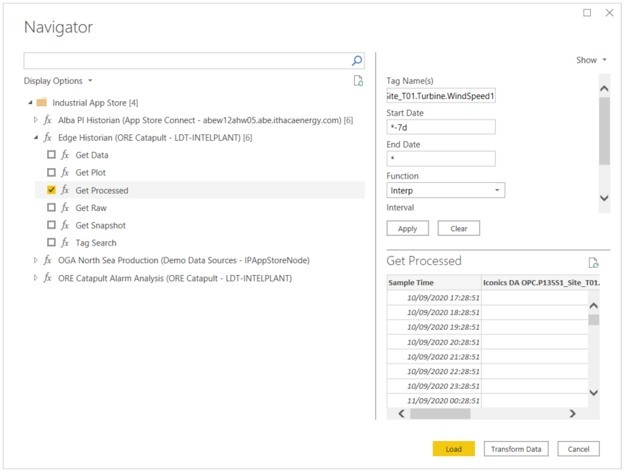

# Getting Started on the ORE Catapult Dataset

For this exercise, you will be connecting to ORE Catapult's Edge Historian (a large database for storing time-series process data) recording live data from the Levenmouth wind turbine.

* Data is accessible via a “tag” – *a unique identifier for a measurement*.

For a shortlist of useful tags, refer to the [Challenge 1 Help Sheet](https://github.com/intelligentplant/codeless-hackathon-resource/blob/master/resources/Challenge%201%20-%20Info%20Pack.pdf).

## How to get data into Power BI

We can interrogate the historian as follows...

1. **Start Power BI and open the Industrial App Store Connector**<br />
The connector is certified and distributed by Microsoft with Power BI updates :fire:. Just click Get data and look for Industrial App Store data connector.


2. **Log in**<br />
Sign in using Microsoft and enter you Hackathon account credentials. 


3. **Enter Query Parameters**<br />
From the Navigator, select *Edge Historian* and enter the parameters for your query.

For example, if we wanted to obtain hourly  Power and Windspeed readings for the past 7 days, we’d enter the following parameters into the Industrial App Store Data Connector for Power BI.



| Parameter | Value | Notes |
|-----------|-------|-------|
|Tag Names |  Iconics DA OPC.P135S1_Site_T01.Turbine.SubIprPrivPwr, Iconics DA OPC.P135S1_Site_T01.Turbine.WindSpeed1 | Comma separated list of tags |
| Start Date | *-7d| A relative date notation meaning "now minus 7 days". Alternatively, an explicit date could be used (e.g. "2010-09-15"). |
|End Date | *| A relative date notation meaning "now". Alternatively, an explicit date could be used (e.g. "2010-09-21").|
| Function | Interp | Interpolated data, this means an approximated value is derived for the specified interval.|
| Interval | 1h | 1 hour |

4. **Load data**<br />Hit apply, tick the checkbox next to the function and hit *Load* to start working on the data in Power BI.<br />

> NOTE: This connects to the source historian on site to retrieve data :fire:. If you used *relative* timestamps in your data query this means your result data set will always be up to date.

## How to get data in Power Automate :zap:

Please follow a step by step guide [here](https://github.com/intelligentplant/codeless-hackathon-resource/blob/master/resources/get-data-into-power-platform.MD#power-automate-zap "Industrial App Store - Get data into Power Automate"). Make sure you know which tag names you want to interogate and please use the following value for qualified data source name (this is a qualified data source name for on-site historian).

```text
FBF94704A9C213490B00CFD213C6CDB41653A7E8461EE9AA43871BDD6B4795D2.Edge Historian
```

## More Info...

* [**Get data into Power Platform**](https://github.com/intelligentplant/codeless-hackathon-resource/blob/master/resources/get-data-into-power-platform.MD)<br/> General instructions on how to use Industrial App Store connectors for Power BI, Power Apps, Power Automate Flow and Power Virtual Agent.

* [**Industrial App Store Power BI Connector**](https://github.com/intelligentplant/IAS-Power-BI-connector)<br/> Detailed documentation on IAS Power BI Connecter.

## Good luck :v: