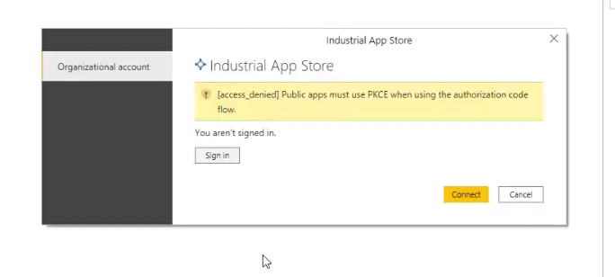
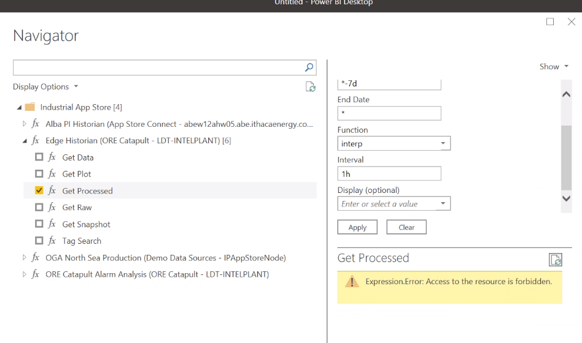
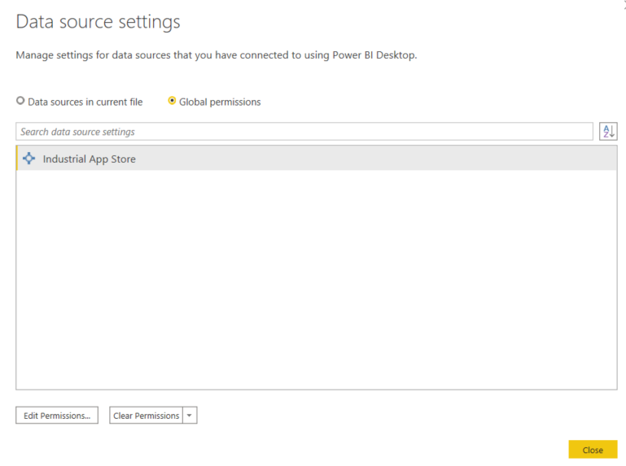
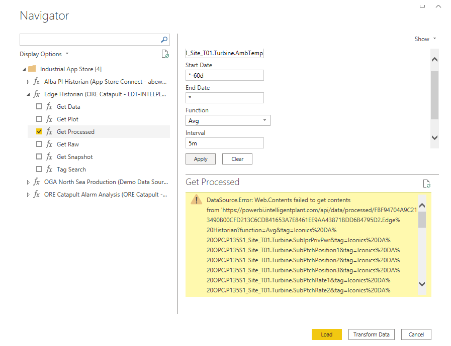

# Having problems with Power BI and/or Industrial App Store Data Connector?

Take a look below and see if you're hitting any of these errors?

## Public Apps must use PKCE...

You're using an outdated version of Power BI. Download the latest version of Power BI (August 2020).

## Expression Error

An invalid parameter has been entered. In the case above, "interp" has been manually entered rather than "Interp" selected from the drop-down list.

## Authentication Error
Try resetting the data source permissions and log in again.

In Power BI, select...

 1. File > Options and Settings > Data Source Settings > Global Permissions > Industrial App Store
 2. Click "Clear Permissions"
}

## Failed to get contents

Have you hit an historian limit? In the above query the user has attempted to request 60 days of data at 5 min intervals per tag (17,280 data points per tag).

