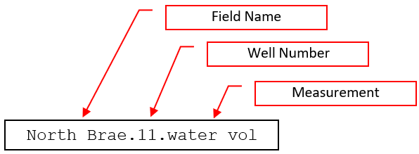
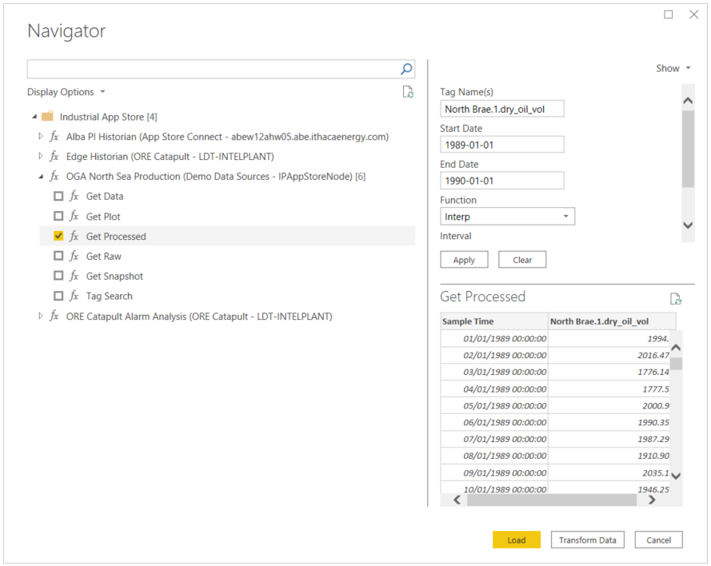

# Getting Started on the North Brae Dataset

The North Brae data set covers measurements (flow, pressure, temperature, etc..) related to 34 subsea wells that were operational between 12 Apr 1988 – 31 Dec 2019. 

* The data is stored on an Historian - *a large database for storing time-series process data*.

* Data is accessible via a “tag” – *a unique identifier for a measurement*.

Tag construction will vary between assets and historians, but for the North Brae dataset, it is composed as follows: 

The measurements available on each well are:

| Measurement | Descriptions | Unit |
|-------------|--------------|------|
|dry_oil_vol  | Oil production | Sm3  |
|gas_vol      | Gas production | KSm3 |
|water_vol    | Water produced | Sm3 |
|choke_size_prod | Production Choke position | % open |
|fline_press | Flowline pressure | barg |
| fline_temp | Flowline temperature	| degC |
| flowing_thp_prod | Flowing top hole pressure | barg |
| shut_in_thp | Shut in top hole pressure | barg |

## How to get data into Power BI

We can interrogate the historian as follows...

### Get the connector

 The connector is certified and distributed by Microsoft with Power BI updates. Click *Get Data* and look for *Industrial App Store* data connector.

### Log in

Sign in using Microsoft and enter you Hackathon account credentials. 

### Enter Query Parameters

From the Navigator, select *OGA North Sea Production* and enter the parameters for your query.

For example, if we want to obtain daily readings of oil, gas and water produced by Well 1 for 1989, we’d enter the following parameters into the Industrial App Store Connect for Power BI.

| Parameter | Value | Notes |
|-----------|-------|-------|
|Tag Names |  North Brae.1.dry_oil_vol, North Brae.1.gas_vol, North Brae.1.water_vol | Comma separated list of tags |
| Start Date | 1989-01-01| |
|End Date | 1990-01-01 | |
| Function | Interp | Interpolated data, this means that if no underlying data has been recorded, an interpolated value is returned. |
| Interval | 1d | 1 day |

## More Info...

* [**Get data into Power Platform**](https://github.com/intelligentplant/codeless-hackathon-resource/blob/master/resources/get-data-into-power-platform.MD)  General instructions on how to use Industrial App Store connectors for Power BI, Power Apps, Power Automate Flow and Power Virtual Agent.

* [**Industrial App Store Power BI Connector**](https://github.com/intelligentplant/IAS-Power-BI-connector)  Detailed documentation on IAS Power BI Connecter.

## Good luck :v: